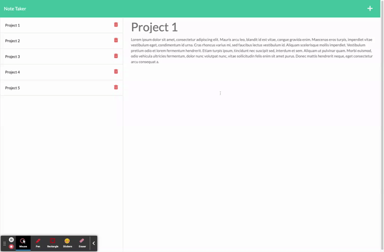
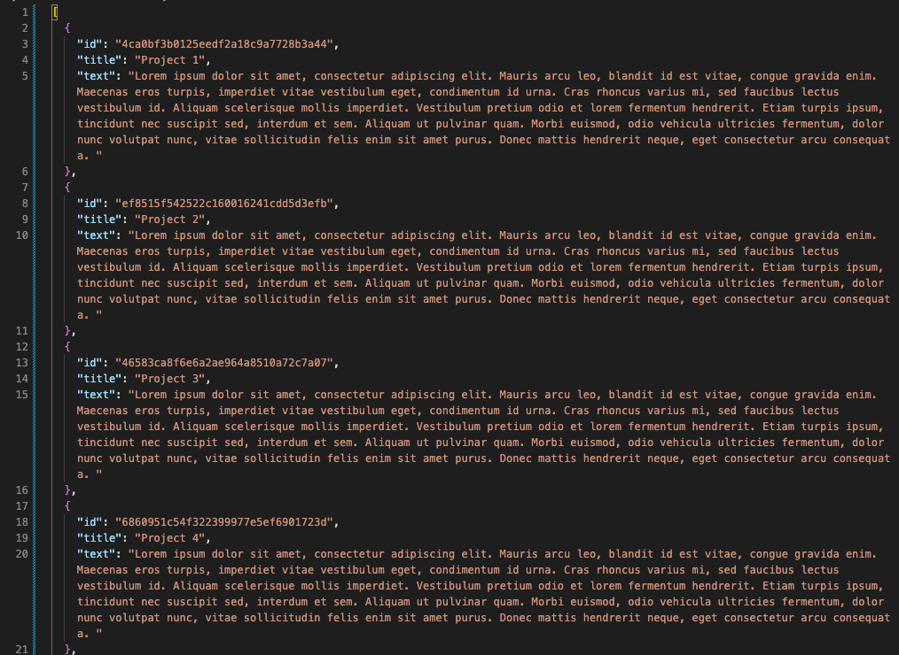

# Note Taker (sjb-note-taker)

##  Description
Note Taker is an application that allows users to write and save thier notes. Note Taker uses an Express.js back end and notes are saved and retrieved from a JSON file. 

## User Story

```md
AS A small business owner
I WANT to be able to write and save notes
SO THAT I can organize my thoughts and keep track of tasks I need to complete
```

## Preview 






## Installation 

Local Installation
* Clone the repository from [Github](git@github.com:simmmmo/sjb-note-taker.git)
* Ensure Node.js is installed
* Install [express package](https://www.npmjs.com/package/express)
```bash
npm install
```

## Usage 
Run 
```bash
npm start
```

Application wll confirm it is runnining in terminal. 
```bash
App listening at http://localhost:3001 🚀
```

Open http://localhost:3001 in your browser

## Technology 
Crypto module - to produce unique character string for the note ID


## Project Links
* Walkthrough video link

https://drive.google.com/file/d/160sOoBxey8-NCffqtcD1Z7qxd1oFm1R6/view

Add and remove notes

https://drive.google.com/file/d/1I7w2NTsUwNi8BHANDJmhcjGDRv2lUnIi/view


* Repo name

sjb-note-taker 

* GitHub enviroment

https://github.com/simmmmo/sjb-note-taker

git@github.com:simmmmo/sjb-note-taker.git

https://simmmmo.github.io/sjb-note-taker/

